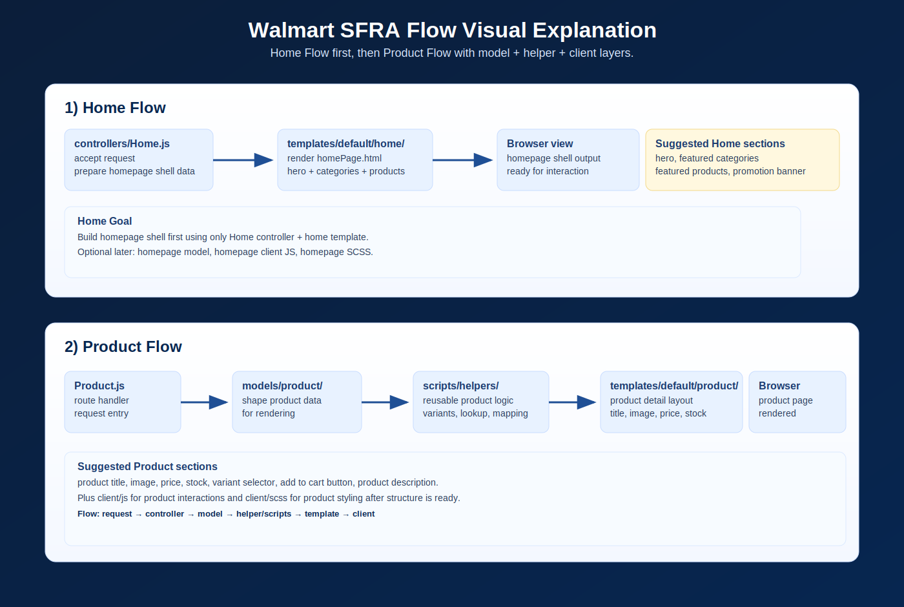

# Walmart Home + Product Flow Visual

This image explains the requested Home Flow and Product Flow as a simple visual reference.

## Home Flow

- Start with `controllers/Home.js`
- Render from `templates/default/home/`
- Goal: homepage shell with hero, featured categories, featured products, and promotion banner

## Product Flow

- Continue with `controllers/Product.js`
- Use `models/product/` for product view shaping
- Use `scripts/helpers/` for reusable product logic
- Render from `templates/default/product/`
- Add `client/js/` for product interactions
- Add `client/scss/` for product styling
